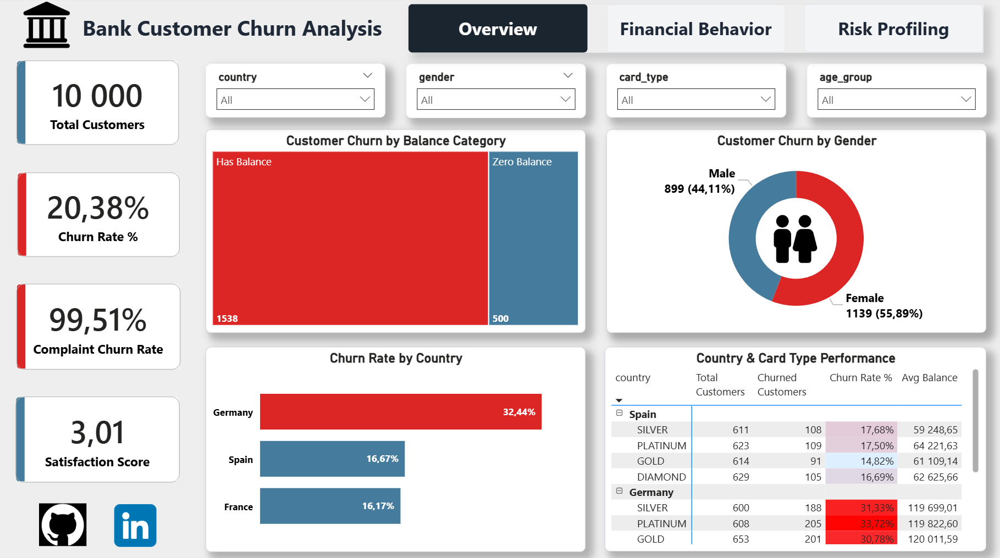
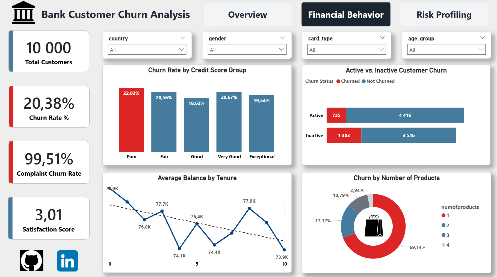
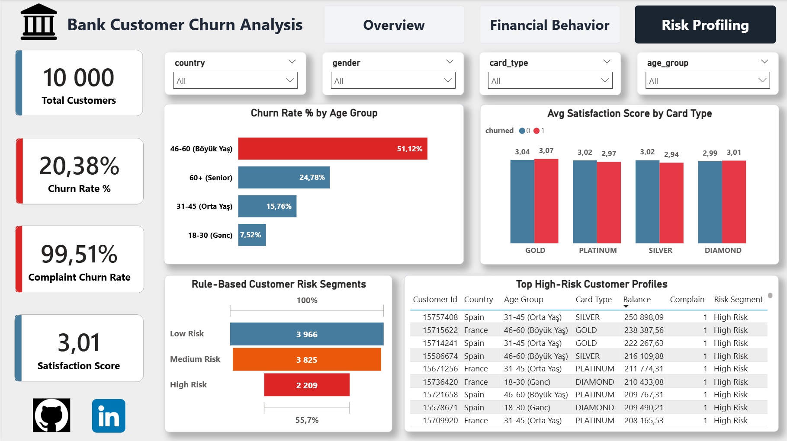
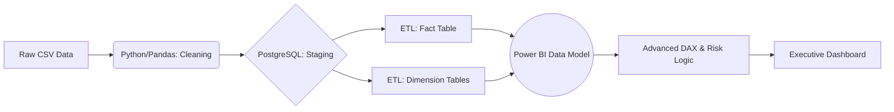

# 🏦 Enterprise Bank Customer Churn Analytics


An end-to-end, enterprise-grade data analytics pipeline designed to identify, quantify, and mitigate bank customer attrition. This project transforms raw operational data into actionable business intelligence through rigorous ETL processes, relational data modeling (Star Schema), and an advanced, premium UI/UX Power BI executive dashboard.

## 📸 Executive Dashboard Previews

### 1. Executive Overview
Focuses on high-level KPIs, geographic risk distribution, and complaint impact.


### 2. Financial Behavior
Analyzes product engagement, credit scores, and active vs. inactive customer retention.


### 3. Risk Profiling
Dynamic Rule-Based Risk Segmentation highlighting high-risk customer profiles for immediate intervention.


## 🏗️ Data Architecture & ETL Pipeline

The project follows a robust Data Engineering and BI lifecycle:



*(Note: If viewing outside GitHub, the pipeline follows: Raw Data ➔ Python Cleaning ➔ PostgreSQL Staging ➔ Star Schema Construction ➔ Power BI Import ➔ DAX Modeling ➔ Premium Visualization)*

### Relational Data Model (Star Schema)

The database was architected in PostgreSQL using a Star Schema topology to optimize analytical query performance and ensure a seamless semantic model in Power BI.

- **fact_churn**: The central fact table recording transactional metrics (balances, product counts, satisfaction scores, complaint flags, and exit status).
- **Dimensions**:
  - `dim_customer` (Demographics, Credit Score Tiers, Age Groups, Activity Status)
  - `dim_geography` (Countries)
  - `dim_cardtype` (SILVER, GOLD, PLATINUM, DIAMOND)

## 📊 Key Business Insights & Strategic Recommendations

Extensive SQL querying and Power BI cross-filtering revealed highly actionable insights for the executive board, paired with immediate strategic recommendations:

### 🚨 1. The Complaint Catalyst
* **Insight:** **99.51%** of customers who logged a complaint eventually churned (2,034 out of 2,044). The churn rate for non-complaining customers is near zero (**0.05%**).
* **Recommendation:** Overhaul the Customer Support resolution pipeline. Implement an automated "Code Red" alert system for any customer filing a complaint, ensuring a human agent contacts them with a retention offer within 24 hours.

### 🌍 2. The German Market Anomaly
* **Insight:** The churn rate in Germany is critically high at **~32.44%**, regardless of card tier. Departing German customers hold an average balance of **€120,000**, meaning the financial bleed is disproportionately severe.
* **Recommendation:** Launch a localized investigation into the German branch operations. Introduce high-yield retention products (e.g., premium deposit rates) specifically targeted at German customers with balances exceeding €100,000.

### 📉 3. Age Vulnerability (Senior Professionals)
* **Insight:** The **46–60 age demographic** exhibits a massive **51.12% churn rate**, identifying them as the most flight-risk segment.
* **Recommendation:** Develop bespoke financial products for this demographic, such as early retirement planning consultations, family wealth management packages, or VIP customer relationship managers.

### 💳 4. Product Saturation & Engagement
* **Insight:** Clients utilizing only a **single banking product** account for **69.14%** of the total churned customer base.
* **Recommendation:** Execute aggressive cross-selling campaigns. Offer incentives (e.g., cashback bonuses, zero-fee credit cards) to single-product customers who open a secondary account or investment portfolio, effectively locking them into the bank's ecosystem.

## 🧠 Advanced BI: Rule-Based Risk Segmentation

To provide actionable intelligence, a dynamic Risk Profiling algorithm was engineered using DAX. Instead of generic predictions, this rule-based segmenter evaluates distinct business triggers to categorize customers into risk tiers instantly.

```dax
Risk_Segment = 
VAR IsComplain = RELATED(fact_churn[complain])
VAR CustomerAgeGroup = dim_customer[age_group]
VAR CustomerCountry = RELATED(dim_geography[country])
VAR CustomerIsActive = dim_customer[isactivemember]

RETURN
SWITCH(
    TRUE(),
    -- High Risk: Complaining customers OR (German customers aged 46-60)
    IsComplain = 1 || (CustomerCountry = "Germany" && CustomerAgeGroup = "46-60 (Böyük Yaş)"), "High Risk",
    
    -- Medium Risk: Inactive customers OR Senior (60+) customers
    CustomerIsActive = 0 || CustomerAgeGroup = "60+ (Senior)", "Medium Risk",
    
    -- Low Risk: All remaining stable accounts
    "Low Risk"
)
```

## 📂 Repository Navigation

```
├── data/                               # Raw and Python-cleaned datasets
├── sql/                                # PostgreSQL ETL pipeline
│   ├── 01_staging_setup.sql            # Table DDL & CSV ingestion
│   ├── 02_star_schema_ddl.sql          # Dimension & Fact definitions
│   ├── 03_etl_data_insertion.sql       # Staging to Star Schema migration
│   └── 04_analytical_queries.sql       # Ad-hoc business SQL queries
├── powerbi/
│   └── Bank_Customer_Churn_Analysis.pbix # The final interactive dashboard
├── images/                             # High-res UI/UX screenshots
└── README.md
```

## 🚀 Reproduction Instructions

1. **Clone the repository**: `git clone https://github.com/your-username/bank-customer-churn-analytics.git`
2. **Database Provisioning**: Execute the SQL scripts in the `/sql` directory sequentially within your PostgreSQL environment (pgAdmin 4 recommended) to build the Star Schema and populate the data.
3. **Dashboard Activation**: Open the `.pbix` file in Power BI Desktop. Navigate to `Transform Data -> Data Source Settings` to update the PostgreSQL credentials to your local or cloud server instance.

## 👤 Author

**Nihat Rzaquluzade | Junior Data Analyst**

This project was developed as a professional **Data Analytics portfolio project**, demonstrating skills in Python, PostgreSQL, ETL processes, data cleaning, SQL analysis, and Power BI data visualization.

[](https://github.com/nihatrza)

[](https://www.linkedin.com/in/nihat-rzaquluzade/)

---
